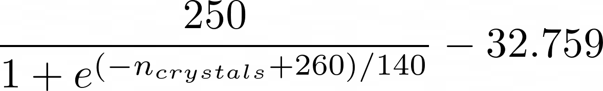
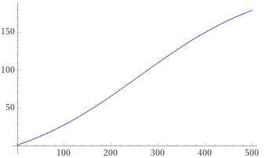
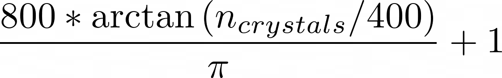
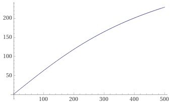
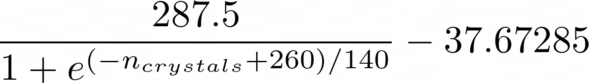
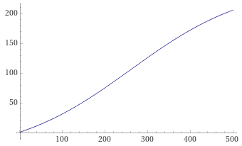
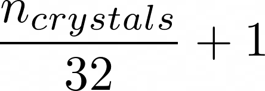
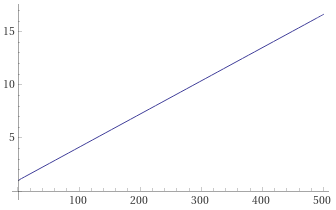

# How Does Vault Altar Recipe Scaling Work?

The recipe your altar will require you to fulfil depends on both your level and the amount of crystals you have crafted before.

**Level**

At level 10, 20, 40, 75 and 90 the pool of items the recipe pulls from will change. Each of those levels does not only have their specific items it may require, but also sets the base amount for them.

For example, Cobblestone has a base amount of 1–4 at level 0, up to 4–12 at level 90.

**Crystals Crafted**

The more crystals you have already crafted, the more items you will need for each and every altar recipe that follows. The math for scaling is not quite trivial, but hey, here it is:

(as of update 10.0)

**Resource Pool**:

 

**Farmable Pool**:

 

**Mob Pool**:

 

**Misc Pool**:

 
