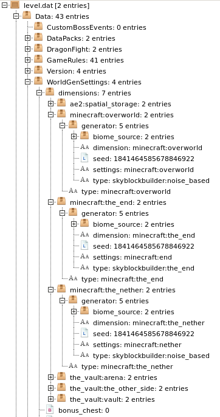

# How to Setup a Sky Vaults Server

This guide assumes you already have a Vault Hunters 3ʳᵈ edition server set up and confirmed that it is working. You will also need a working client.

See <#1059529187079237722> if you need help getting a default server up and running.

Generating a Sky Vaults world on a server currently does not work out of the box, so there will be some manual steps involved. Be sure you know where your client and server files are located.

As of **Update 7.7**, the steps below are confirmed working.

If you are running a server through a hosting service, the approach will 
generally be the same. You’ll just have to find out first how to copy files to 
the server folder.

This is for running a “vanilla” Sky Vaults server. _If you want to have separate islands for everyone, see the next message instead_.

1. Temporarily disable Terralith on your Vault Hunters _client_ e.g. by moving it out of your `mods` folder.
2. Generate a world on the client and make sure to set the “World Type” to “Sky Vaults” under “More World Options…”. **Make sure that the spawn is not in an ocean biome**, otherwise you will run into issues later on, e.g. having to move potentially thousands of blocks to find a biome that can spawn passive animals.
3. Client-side that’s all you have to do, you can re-enable Terralith now.
4. If your server is running, stop it.
5. Remove the Terralith mod from the server. _You will have to make sure to do this after every pack update_. It is probably wise to have a server update script.
6. Delete or move your existing world from the _server_ folder. It should be called `world` by default, otherwise check your `server.properties` for the `level-name`.
7. Copy the world you generated in step 2 from your client to your server folder. You will find it in `saves`.
8. Rename the copied world to whatever your world was called in step 6.
9. Edit `server.properties` and set `level-type` to `the_vault:sky_vaults`. This is currently not needed, but better be safe than sorry. (Note: The server will probably change this to `the_vault\:sky_vaults`. That is just unnecessary escaping and no reason to panic.)
10. Start the server and make sure there aren’t any errors that stop it from working.
11. Log into the server. You should find yourself on a lone island in the void.
12. Go into creative mode and fly a couple hundred blocks out to make sure everything is working properly. You should not run into any generated terrain.

Congratulations, you now have a working Sky Vaults server!

Do keep in mind that by default everyone will spawn in on the same island. There 
currently is no way to change that without adding extra mods to the pack.

**How to Setup Sky Vaults with Individual Sky Islands Using the Skyblock Builder Mod**

As stated above, there currently is no default way to give everyone (or every team) on a server their own sky block. So you will have to add a mod for it.

**This will change the way the world is generated.** I haven’t found any issue with it yet, but it might – now or after future changes – mean that your world behaves slightly differently compared to a “vanilla” Sky Vaults world. The Nether will be a void with structures as usual, the end will only have the central island. Regular Sky Vaults generates a vanilla Minecraft end, but it’s inaccessible anyway.

**As of 9.0.2, the quest book does not offer Sky Vaults quests on servers set up in this way and will default to the regular quest line (which a) sucks and b) forces you to cheat in a Heart of the Sea for your Alchemy Table).**

You will need:

– A working Vault Hunters 3ʳᵈ Edition server.
– The Skyblock Builder mod: <https://www.curseforge.com/minecraft/mc-mods/skyblock-builder>.
– An NBT editor, e.g. NBTExplorer: <https://github.com/jaquadro/NBTExplorer>.
– A structure file for the sky block. The default Sky Vaults island is attached to this message, or you can create your own using structure blocks ingame.

[default.nbt](default.nbt)

1. Stop the server.
2. Add the Skyblock Builder mod to your server. Make sure to re-add it after a pack update. You will also have to install it on the client to be able to play!
3. Remove the Terralith mod from your server. Make sure to do this again after every pack update, too! It is probably wise to have a <#1129822921716662303>.
4. Delete or move your existing world from the _server_ folder. It should be called `world` by default, otherwise check your `server.properties` for the `level-name`.
5. Edit `server.properties` and set `level-type` to `skyblockbuilder:skyblock`. This _is_ necessary, otherwise the commands to manage teams will not work. (Note: The server will probably change this to `skyblockbuilder\:skyblock`. That is just unnecessary escaping and no reason to panic.)
6. Create the folder `config/skyblockbuilder/templates` and copy the attached `default.nbt` there. Or use your custom generated structure, if you have one.
7. Edit `config/skyblockbuilder/common-config.json5`. You should enable `createOwnTeam` and `modifySpawns`, and disable `allowVisits`, `home` and `spawn`. Or copy the attached file into the folder.
8. Start the server to create a new world.
9. Stop the server again.
10. If you are not running your server locally, you might want to download the `level.dat` file from the server’s world folder. Otherwise just commence with the next step.
11. Open the `level.dat` file in your server’s world folder with your NBT editor.
12. Navigate to `Data/WorldGenSettings/dimensions`.
13. Make sure that `minecraft:overworld/generator/type` is `skyblockbuilder:noise_based`, and the Nether and End generator types match the attached screenshot as well.
14. Start the server.

[common-config.json5](common-config.json5)

That’s it, you’re done! If you want, you can now modify the spawn island and build the place you want it to be there.

When a new player logs in (including you, after you are done with the spawn island), they can create their own island with `/skyblock create "<team name>"`. Use the `/skyblock` subcommands to manage your team or invite other people to it.

**How to Setup Individual Islands Using the Server Side Helper Mod**

Do the regular setup, then install <https://legacy.curseforge.com/minecraft/mc-mods/sky-vaulters-support> _on the server only_.

See https://discord.com/channels/889424759018901514/1129555901905375353 for details.
