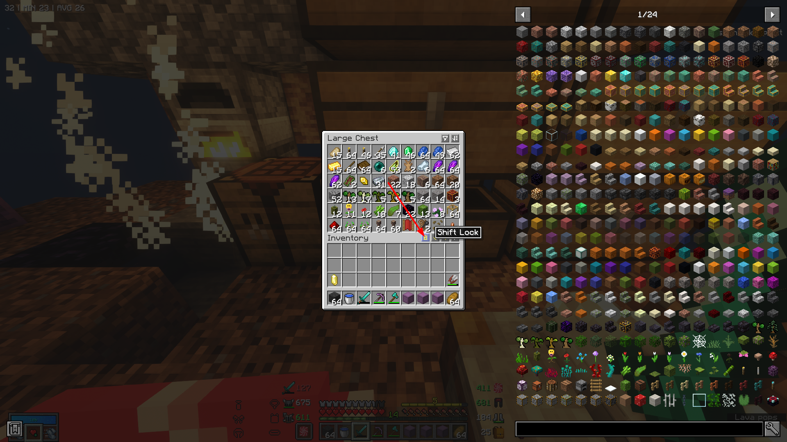
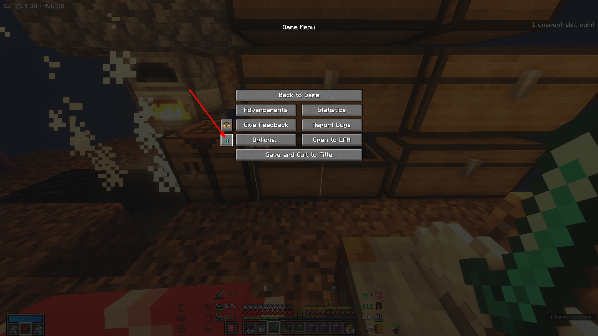
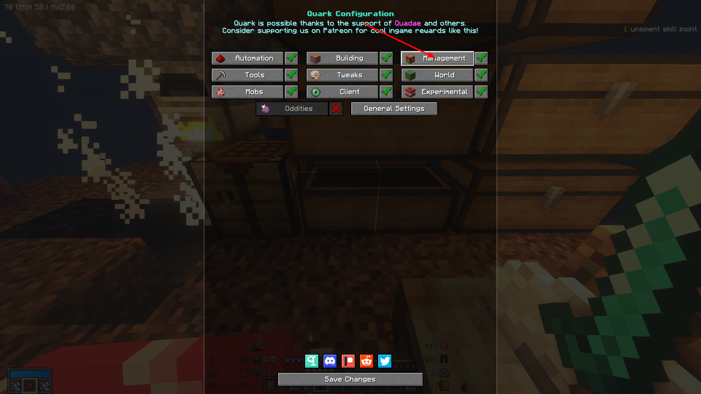
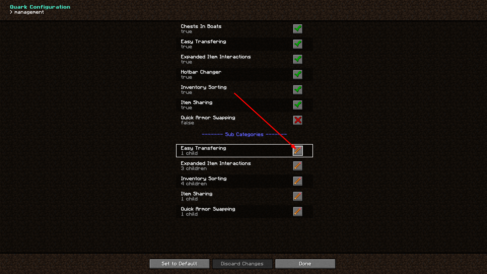
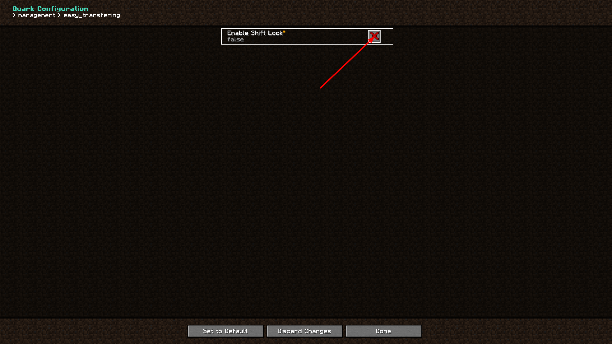
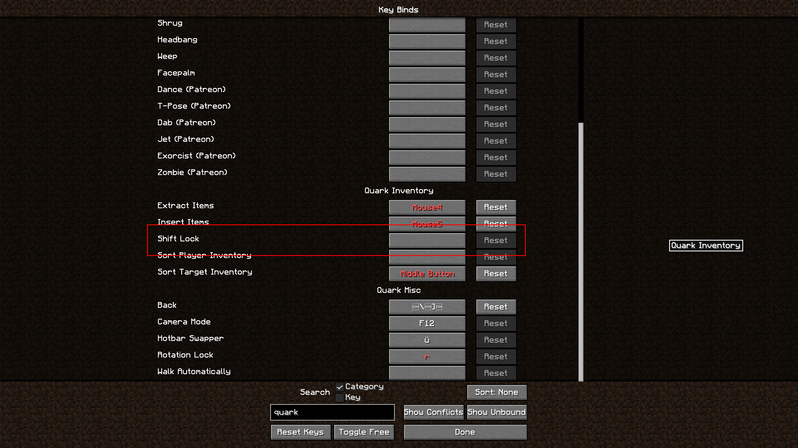

# “My Shift Key Is Stuck”

You have accidentally enabled Shift Lock. It’s a Quark “feature”. Open a chest inventory, then click the little lock icon (again), see attached screenshot.

You can disable this functionality entirely in Quark settings. **This requires a restart of the game to take effect**. Do note that settings will be reset every time you update the pack.

There is a key bind for it as well. You might want to make sure it is not bound 
unless you intend to make use of it.

